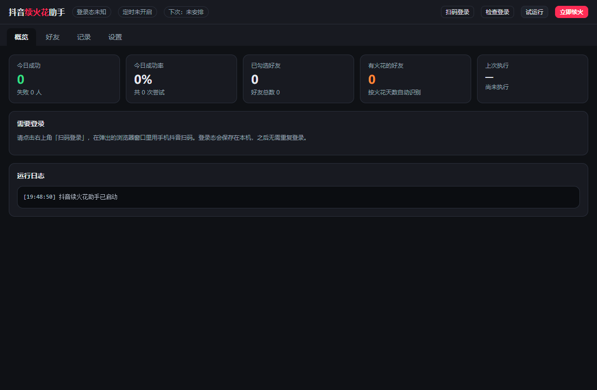
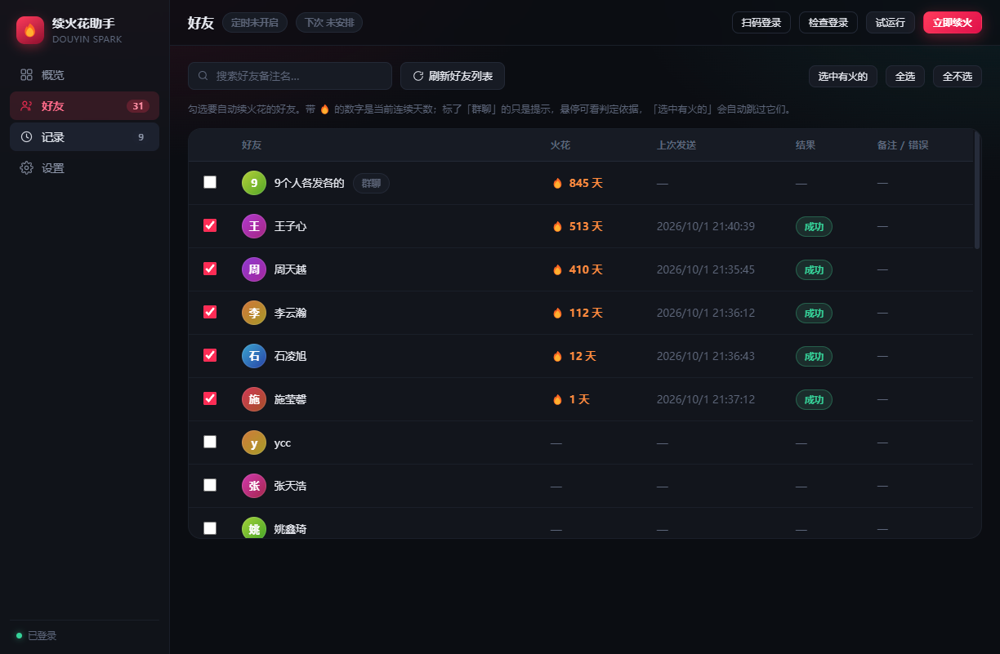
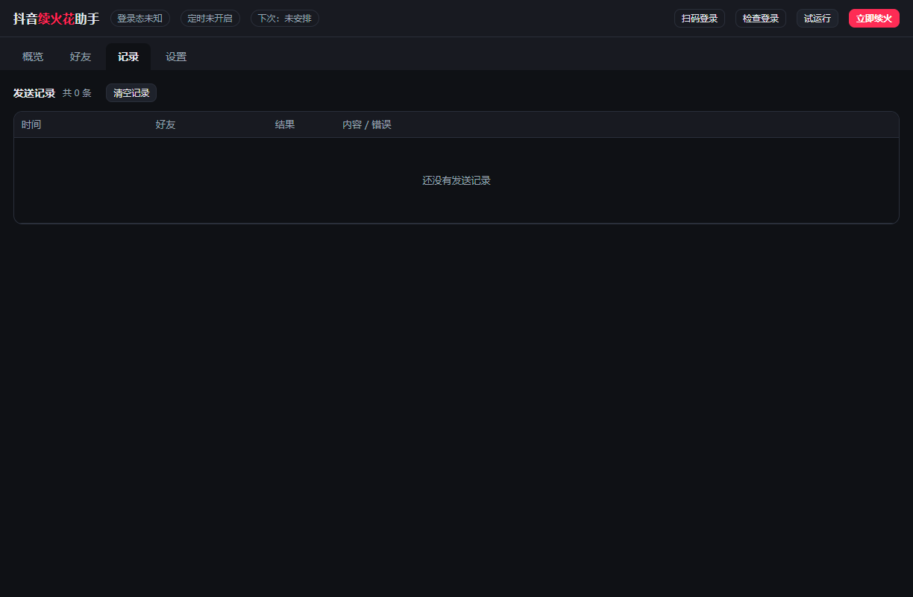
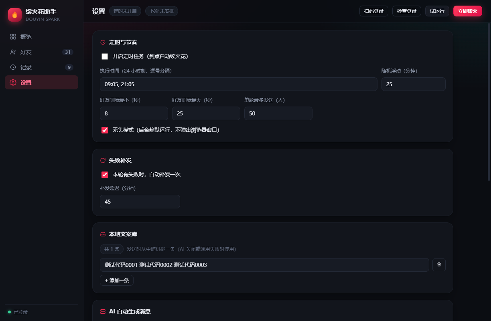

# 抖音续火花助手（Douyin Spark Desktop）

仓库地址：https://github.com/zlf20060301-max/douyin-spark-helper

一个跑在你自己 Windows 电脑上的抖音「续火花」工具。用 Playwright 驱动本机已安装的 Chrome，
在你自己的 IP 和登录态下，每天定时给指定好友发一条消息，保持好友聊天火花（🔥）不熄灭。

> 本项目的浏览器自动化实现在两个 MIT 开源项目的基础上完成，**具体参考了哪些文件与代码见
> [THIRD-PARTY-NOTICES.md](THIRD-PARTY-NOTICES.md)**（含上游版权声明与许可证全文）。

> ⚠️ 自动化发私信不符合抖音社区公约，存在被限流、验证甚至封号的风险。仅限**本人账号、少量好友、每天一两条**的个人自用场景。请勿用于批量营销、多账号代运营或对外提供服务，使用后果自负。

---

## 为什么是「本地浏览器自动化」

调研 GitHub 上 30+ 个同类项目后，主流有四条技术路线：

| 路线 | 代表项目 | 优点 | 缺点 |
|---|---|---|---|
| **浏览器自动化**（本项目采用） | [2061360308/DouYinSparkFlow](https://github.com/2061360308/DouYinSparkFlow) ★387 · [halfwaystudent/douyin-sparkflow](https://github.com/halfwaystudent/douyin-sparkflow) ★522 · [Xiaowu-0916/douyin-spark](https://github.com/Xiaowu-0916/douyin-spark) ★75 | 最稳、最像真人、抗改版 | 需要浏览器，略重 |
| 纯 HTTP 协议逆向 | [xianyulolo8/douyin-spark](https://github.com/xianyulolo8/douyin-spark) | 极轻量，无需浏览器 | 接口一变即失效，互动可能不计入火花 |
| Android 无障碍 | [Quan-Robin/douyin-spark](https://github.com/Quan-Robin/douyin-spark) | 最贴近真实客户端 | 需要一台安卓机常驻 |
| 油猴脚本 | [iosyyds/DouYinFireTool](https://github.com/iosyyds/DouYinFireTool) | 零部署 | 必须浏览器常开，无法无人值守 |

本项目选择**本地浏览器自动化**并做成桌面应用：登录态保存在你自己的电脑上，
用你自己的家庭 IP 扫码登录，最大程度避开「机房 IP + 异地登录」引发的风控。

## 界面

| 概览 | 好友 |
|---|---|
|  |  |

| 记录 | 设置 |
|---|---|
|  |  |

## 功能

- **扫码登录 + 登录态持久化** — 手机扫码一次，之后无需重复登录（登录态存在本机 Chrome 配置目录）
- **好友列表 + 火花天数可视化勾选** — 自动读取会话列表，显示每个好友当前的 🔥 连续天数，点选即续
- **定时自动续火** — 自定义多个执行时间点，带随机浮动、好友间随机间隔，模拟真人节奏
- **本地文案库 + AI 生成** — 每行一条随机挑选；也可接任意 OpenAI 兼容接口（如 DeepSeek）按好友生成不重复的问候
- **续火历史与成功率看板** — 今日成功/失败、成功率、逐条发送记录
- **失败自动补发** — 本轮有失败时，可配置在 N 分钟后只对失败好友补一次
- **风控自保** — 识别「操作频繁 / 安全验证」等提示即中止本轮，避免越撞越死

## 使用

### 直接使用安装包

从 `release/` 目录取 `抖音续火花助手 Setup 0.1.0.exe`，双击安装后启动。

### 从源码运行

```powershell
npm install
npm start        # 构建并启动
npm run dev      # 开发模式（热重载）
npm test         # 跑单元测试（会话类型判定 / 火花天数解析）
npm run pack     # 打包成 Windows 安装包
```

前置条件：Node.js 18+、已安装 Google Chrome（自动调用系统 Chrome，无需额外下载浏览器内核）。

### 首次使用流程

1. 打开应用 → 右上角 **扫码登录** → 在弹出的浏览器窗口里用手机抖音扫码
2. 进入 **好友** 页 → **刷新好友列表** → 勾选要续火花的好友（带 🔥 的是当前有火花的）
3. 进入 **设置** 页 → 打开 **开启定时任务**，设置执行时间 → **保存设置**
4. 也可以随时点右上角 **立即续火** 手动执行一次；**试运行** 只走流程不真正发送

## 工作原理

```
Electron 主进程
├── Playwright（playwright-core + 系统 Chrome，持久化 profile）
│     └── 打开 douyin.com/chat，读取会话列表，逐个发送
├── 调度器（本地时间 + 每日稳定随机偏移）
├── 消息生成（AI 接口 → 失败回退本地文案库）
└── 数据层（JSON，存放于 %APPDATA%/douyin-spark-desktop/data）
```

关键 DOM 选择器来自 MIT 许可项目的实测结果（`.conversationConversationItemtitle` 好友名、
`.commonStreaknormalText` 火花天数、`[data-e2e="conversation-item"]` 会话项、
Draft.js 编辑器 + Enter 发送），并按「点击后校验右侧会话标题确实切换」防止错发。

## 目录结构

```
src/
  main/                        Electron 主进程
    automation/
      scripts/*.js             在浏览器里执行的 DOM 脚本
      selectors.ts             选择器与脚本出口
      douyin.ts                登录 / 拉好友 / 发送引擎
    ai.ts                      消息生成（本地 + OpenAI 兼容）
    scheduler.ts               定时调度
    store.ts                   数据持久化
    logbus.ts                  日志总线
    index.ts                   窗口、IPC、任务编排
  preload/index.ts             contextBridge 安全桥
  renderer/                    React 界面
  shared/types.ts              共享类型
```

## 更新日志

### v0.1.3

**修复：真发送卡在输入框，30 秒超时后失败。**

抖音私信输入框**已经从 Draft.js 换成了自研的 editor-kit**，参考项目里那两个 Draft.js 选择器
实测 `count=0` 早已失效：

| 选择器 | 实测 |
|---|---|
| `[data-e2e="msg-input"] .public-DraftEditor-content` | count=0 ❌ |
| `.DraftEditor-root [contenteditable="true"]` | count=0 ❌ |
| `[data-e2e="msg-input"] [contenteditable="true"]` | count=1 ✅ |

当前真实结构：`div.editor-kit-container.messageEditorinputArea[contenteditable=true]`，
父节点 `.messageEditorimChatEditorContainer`、祖父 `.messageMsgInputinputRow`。
现已把可用选择器提到最前，并合并成 `EDITOR_SELECTOR`，供查找/点击/清空/判空统一使用。

**修复：零宽空格导致「输入框已清空」永远判定失败。**

该编辑器在空的时候仍会留一个零宽空格 U+200B，而 JS 的 `String.trim()` **不把 U+200B 当空白**
（实测 `trim().length === 1`）。旧的判空逻辑因此永远返回"非空"，会让每一次成功的发送都被
误判成失败。现已显式剥离 `U+200B/U+200C/U+200D/U+FEFF` 后再判断。

**修复：试运行被误记入发送历史。** 试运行不再写入历史、也不更新好友的最后发送状态，
避免把「试运行通过」当成「今天已续火」，污染统计和补发顺序。

**新增：发送按钮兜底。** 按 Enter 后若输入框未清空，会尝试点击输入区最右侧的发送图标再确认一次。

**其它：** 参考项目的 `.messageMsgInputpublishBtn` 类名实测也已不存在，故不再依赖它。

## 更新日志（v0.1.2）

### v0.1.2

**修复：会话切换与列表滚动完全无效（静默失效）。** 表现为点「试运行」后界面一直停在
「正在执行…」，既不成功也不报错，只能干等。

根因是 Playwright 的一个隐蔽行为 —— 把带参数的箭头函数**源码字符串**传给 `page.evaluate` 时，
函数根本不会被调用：

| 调用形式 | 返回值 | 实际效果 |
|---|---|---|
| `page.evaluate('((x) => {...})', arg)` | `undefined` | **什么都不做，且不报错** |
| `page.evaluate('((x) => {...})(arg)')` | 正常返回值 | 正常执行 |

项目里只有 `JS_CLICK_BY_NAME` 和 `JS_SCROLL_TO` 是带参数的箭头函数（其余无参脚本本来就是
`(() => {...})()` 自执行的，所以一直正常），于是「点击某好友」和「滚动列表」从头到尾都是空操作。
现已统一改为自执行表达式（见 `evalWithArg()`）。

同时补上之前缺失的健壮性：

- **所有浏览器调用都加了硬超时**。Playwright 的 `evaluate` / `mouse` 没有默认超时，一旦
  页面异常就会永远不返回。现在任一步超时都会记录原因并继续，不会再无限卡住。
- **单个好友处理有 240 秒总超时**，某个好友出问题不会拖垮整轮。
- **全程进度日志**：`[1/5] 处理好友：xxx`、`→ 正在切换会话`、`→ 已进入会话`，
  卡在哪一步一眼可见。
- 修正 `verifyInConversation` 里 `/s+/g` 的正则笔误（应为 `[\s\u3000]+/g`）。
- 无头模式下不再调用 `bringToFront()`（无头没有前台窗口概念，该调用可能不返回）。

> 因为滚动列表以前是空操作，v0.1.1 及更早「刷新好友列表」只读到了首屏渲染的会话。
> 升级后重新刷新，可能会读出更多会话。

## 更新日志（v0.1.1）

### v0.1.1

**修复：所有好友都无法勾选。** v0.1.0 用 `participantCount > 1` 判断群聊，而 1v1 会话的
`participantCount` 实测就是 **2**，导致每个好友都被判成群聊、勾选框全部被禁用。
现改为参考项目实测的判据，优先级从硬到软：

1. `conv_id` 里没有 `:` → 群/特殊会话（群聊 id 是 SDK 分配的纯数字，单聊恒为 `0:1:<小uid>:<大uid>`）
2. `conv_id` 前缀 `0:1:` → 单聊
3. `conv_id` 前缀 `0:2:` → 群聊
4. `participantCount > 2` → 群聊

其余改进：

- **群聊判定不再禁用勾选框**，只作为界面提示（悬停可看判定依据）。判定结果不该挡住使用者。
- 好友记录新增 `convId` / `participantCount` 字段，并在日志里输出单聊/群聊/有火花的分项统计。
- 新增单元测试：`npm test`（13 条用例，含上述回归用例）。

## 免责声明


本项目仅供学习和个人自用。使用者只能操作本人拥有或已获得明确授权的账号，
并须自行遵守抖音用户协议及相关法律法规。因使用本项目产生的一切后果由使用者自行承担。

## 参考与署名（这些是「参考什么做出来的」）

本项目的浏览器自动化部分**建立在两个 MIT 许可项目的公开成果之上**，并非从零逆向。
逐文件、逐项对应关系见 **[THIRD-PARTY-NOTICES.md](THIRD-PARTY-NOTICES.md)**，摘要如下：

| 来源项目 | 许可证 | 具体参考了什么 |
|---|---|---|
| [2061360308/DouYinSparkFlow](https://github.com/2061360308/DouYinSparkFlow) | MIT | **改编了**它的 `JS_COLLECT`（React fiber 遍历取会话模型）用于 `scripts/collect.js`；页面选择器常量（会话项/标题/列表容器/选中态/输入框候选/发送按钮）；虚拟列表滚动扫描思路；登录态三级判定顺序 |
| [Xiaowu-0916/douyin-spark](https://github.com/Xiaowu-0916/douyin-spark) | MIT | **改编了**它的发送加固策略：点击后校验右侧会话标题防错发、搜索兜底、命中风控关键词立即停轮、以输入框清空判定发送成功、失败重试一次；火花天数取自 `.commonStreaknormalText` |
| [halfwaystudent/douyin-sparkflow](https://github.com/halfwaystudent/douyin-sparkflow) | PolyForm NC | 仅作架构调研（多账号控制台的信息架构、发送状态机思路），**未使用任何代码** |
| [baiyingawa/AutoDouyinSpark](https://github.com/baiyingawa/AutoDouyinSpark) | 未声明 | 仅读 README 参考功能取舍（跳过群聊、发送后截图存档），**未使用任何代码** |

此外在选型阶段横向比较了 [Yuriz132/douyin-cloud-streak](https://github.com/Yuriz132/douyin-cloud-streak)、
[xianyulolo8/douyin-spark](https://github.com/xianyulolo8/douyin-spark)（纯 HTTP Protobuf 方案）、
[Quan-Robin/douyin-spark](https://github.com/Quan-Robin/douyin-spark)（Android 无障碍方案）、
[iosyyds/DouYinFireTool](https://github.com/iosyyds/DouYinFireTool)（油猴脚本方案）等 30+ 个项目，
**均未使用其代码**，完整清单同样列在 THIRD-PARTY-NOTICES.md。

上表两个 MIT 项目的原始版权声明与完整许可证全文，已按要求收录在 [THIRD-PARTY-NOTICES.md](THIRD-PARTY-NOTICES.md)。

## 许可

本项目自有代码采用 **MIT**，见 [LICENSE](LICENSE)。第三方依赖的许可证见 [THIRD-PARTY-NOTICES.md](THIRD-PARTY-NOTICES.md)。
